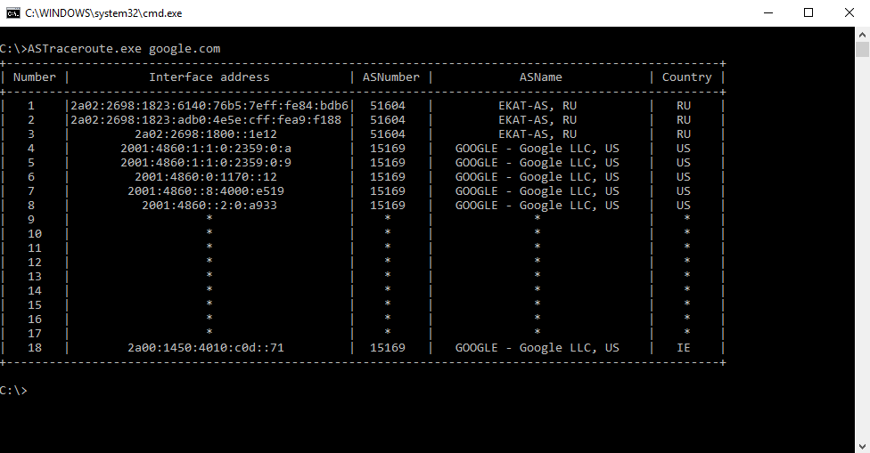

# ASTraceroute
Детализированный аналог утилиты traceroute.
## Пример использования

## Параметры запуска приложения
* target_name (pos. 0)      - Обязательным позиционным аргументом задаётся доменное имя или IP адрес целевого маршрутизатора.

* -h, --maximum_hops    	- Максимальное число маршрутизаторов, которое будет пройдено на пути до цели (по умолчанию 30).

* -w, --timeout		        - Время в миллисекундах ожидания ответа от каждого маршрутизатора (по умолчанию 1000).
							
* --help                    - Справка по использованию программы.
## Автор
Чернущенко Денис, Май 2019